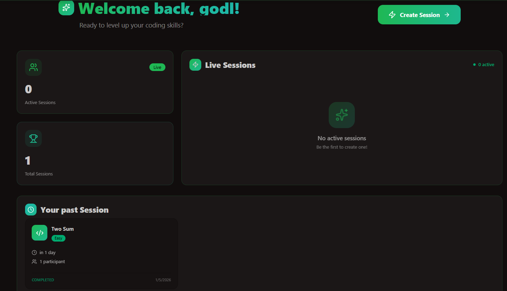
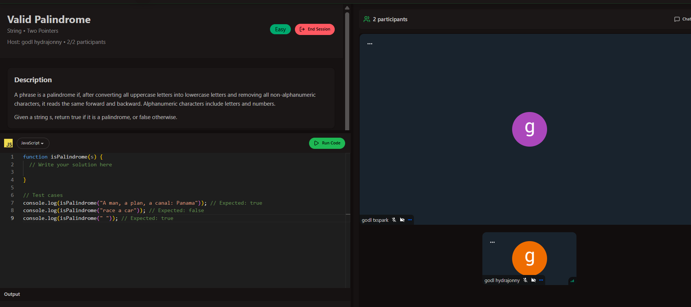
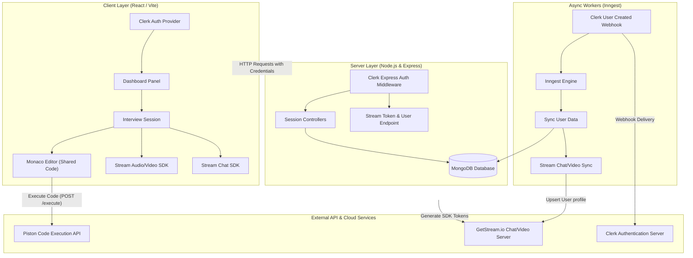

# 💻 TalentIQ: Real-Time Collaborative Remote Interview Platform

[](#)
[](#)
[](#)
[](#)
[](#)
[](#)

TalentIQ is a premium, full-stack remote technical interview platform. It provides candidates and recruiters with a seamless, lag-free environment to conduct live video interviews, collaborate in real-time on code using a Monaco-based editor, compile code using a sandboxed executor, and communicate via text chat.

---

## 🔗 Live Demo & Deployment

* **Deployed Web Application**: [Live App on Render](https://remote-interview-platform-tuj5.onrender.com)

---

## 🖼️ Application Preview

### 📊 Recruiter Dashboard


### 💻 Active Interview Session


---

## ✨ Features

* **🔐 Role-Based Authentication & SSO**: Powered by **Clerk** for robust, modern authentication with full profile management.
* **🎥 Face-to-Face Video & Audio calls**: Integrated **Stream Video SDK** offering low-latency, enterprise-grade video and audio during coding sessions.
* **💻 Collaborative Monaco Code Editor**: Interactive code editor featuring syntax highlighting, code autocomplete, and real-time cursor tracking.
* **⚡ Multi-Language Sandboxed Execution**: Test and execute candidate solutions in **JavaScript**, **Python**, and **Java** with output, error, and status reporting via the **Piston API**.
* **💬 Session Messaging & Chat**: Real-time chat powered by **Stream Chat API** to share hints, test cases, and instructions.
* **📅 Dynamic Session Management**:
  * Hosts can create custom sessions with preset coding problems and difficulty levels.
  * Active sessions feed allows candidates/participants to join in one click.
  * Easy-to-use control panel to safely end and archive sessions.
* **🚀 Background Job Synchronization**: Automated **Inngest** handlers processing Clerk Webhooks to sync user registration and profile updates to MongoDB and Stream.

---

## 🧠 System Architecture



---

## 🛠️ Technical Stack

| Category | Technologies |
| :--- | :--- |
| **Frontend Core** | React (Vite), TanStack React Query, Axios, Google Fonts |
| **UI Components** | Tailwind CSS, DaisyUI (Forest dark theme) |
| **Authentication** | Clerk Auth Suite |
| **Collaboration & Video** | GetStream Video SDK, Monaco Editor, Stream Chat SDK |
| **Backend API** | Node.js, Express.js |
| **Database** | MongoDB + Mongoose |
| **Job Queue & Webhooks** | Inngest Event Pipeline |
| **Code Execution** | Sandboxed Piston API |

---

## ⚙️ Environment Configuration

Create `.env` configuration files in the respective directories before booting up the application.

> [!WARNING]
> Never commit environment configuration files (`.env`) to public repositories.

### 🌐 Frontend Configuration (`Frontend/.env`)
```env
VITE_API_BASE_URL=http://localhost:3000/api
VITE_CLERK_PUBLISHABLE_KEY=pk_test_...
```

### 🎛️ Backend Configuration (`Backend/.env`)
```env
PORT=3000
MONGO_URI=mongodb+srv://...
CLERK_PUBLISHABLE_KEY=pk_test_...
CLERK_SECRET_KEY=sk_test_...
STREAM_API_KEY=your_stream_api_key
STREAM_API_SECRETKEY=your_stream_api_secret_key
CLIENT_URL=http://localhost:5173
```

---

## 🧪 Local Setup Guide

Follow these steps to launch the client and server locally:

### 1️⃣ Clone the Repository
```bash
git clone https://github.com/your-username/remote-interview-platform.git
cd remote-interview-platform
```

### 2️⃣ Initialize the Backend Server
```bash
cd Backend
npm install
# Run the development server
npm run dev
```

### 3️⃣ Initialize the Frontend App
```bash
# In a new terminal window
cd Frontend
npm install
# Run the Vite client
npm run dev
```

### 4️⃣ Local Inngest Dev Server (Optional for webhook debugging)
To trigger and inspect background webhook events locally:
```bash
npx inngest-cli@latest dev -u http://localhost:3000/api/inngest
```

---

## 📦 API Routes Reference

### 🔐 Authentication Context
Auth checking is fully secure and handled by `@clerk/express` middleware before populating MongoDB user state.

### 📅 Session Management APIs (`/api/sessions`)

| Method | Endpoint | Description | Auth Required |
| :--- | :--- | :--- | :---: |
| **POST** | `/api/sessions` | Create a new active interview session | ✅ Yes |
| **GET** | `/api/sessions/active` | Get list of currently active sessions | ✅ Yes |
| **GET** | `/api/sessions/recent` | Fetch past completed sessions for current user | ✅ Yes |
| **GET** | `/api/sessions/:id` | Fetch full details of a specific session | ✅ Yes |
| **POST** | `/api/sessions/join/:id` | Join an active session as a candidate | ✅ Yes |
| **POST** | `/api/sessions/end/:id` | Terminate and archive an active session | ✅ Yes |

### 💬 Chat & Call Token APIs (`/api/chat`)

| Method | Endpoint | Description | Auth Required |
| :--- | :--- | :--- | :---: |
| **GET** | `/api/chat/token` | Request JWT token for Stream Chat and Video authorization | ✅ Yes |

---

## 🚀 Production Deployment Notes

* **Asset Serving**: In production mode (`NODE_ENV=production`), the backend Node server serves pre-built static client files from the `Frontend/dist` directory.
* **CORS Credentials**: Ensure `CLIENT_URL` matches your custom domain on Render so that cookie authentication and cross-site operations succeed.
* **Environment Webhook Integration**: Configure Clerk's Dashboard webhooks to point to `https://<your-app-domain>.onrender.com/api/inngest` to ensure correct background sync when users register or delete accounts.

---

## 🙌 Acknowledgements

* [Clerk Documentation](https://clerk.com/docs) for state-of-the-art authentication flow.
* [Stream Video & Chat SDK](https://getstream.io/) for high performance WebRTC calling and chat features.
* [Monaco Editor React](https://github.com/suren-atoyan/monaco-react) for powering the code editor environment.
* [Piston API Engine](https://github.com/engineer-man/piston) for code execution sandboxing.
